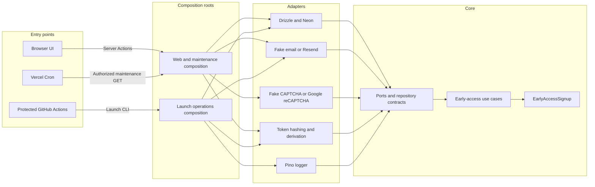
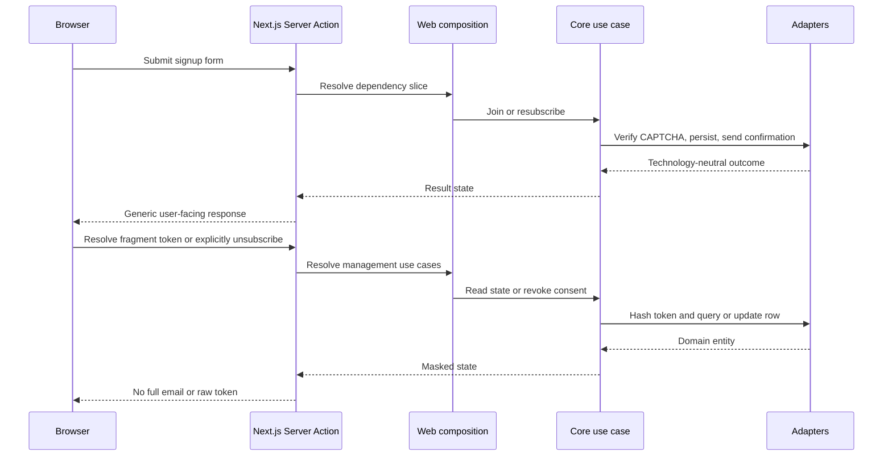
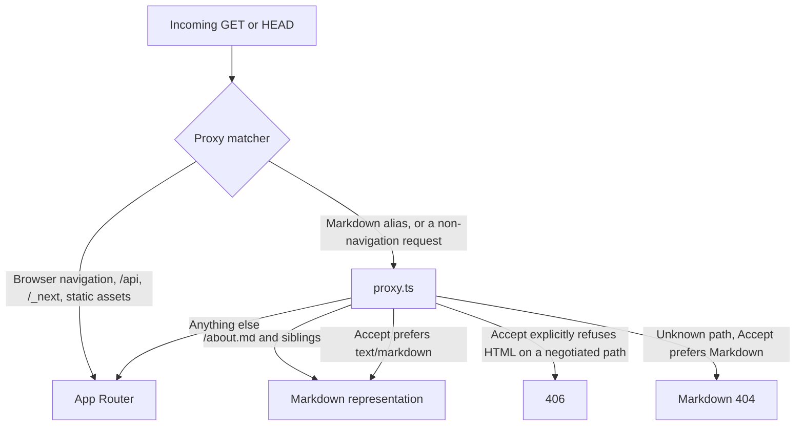

# Architecture

Corpus Landing is a Next.js App Router application with a hexagonal backend.
The public web experience, scheduled maintenance, and human-gated launch send
reuse the same domain behavior while keeping their entry points and credentials
separate.

## Dependency rule

The source dependency direction is:

```text
core ← adapters ← composition
```

- `src/core/` owns entities, errors, port and repository contracts, and use
  cases. It has no Next.js, Drizzle, Neon, Resend, or Google dependency.
- `src/adapters/` implements core contracts for persistence, email, CAPTCHA,
  security, and logging.
- `src/composition/capabilities/` constructs concrete adapters.
- `src/composition/server/` and `src/composition/ops/` expose dependency slices
  for different entry points.
- `src/features/` connects UI and Server Actions to composed use cases.
- `app/` owns routes, layouts, metadata, and the maintenance HTTP boundary.



Arrows show runtime calls toward the abstractions depended on. Imports follow
the same inward direction: composition may import adapters and core; adapters
may import core contracts; core never imports adapters or composition.

## Composition roots

### Web and scheduled maintenance

`src/composition/root.ts` loads validated server configuration and provides
persistence, notification, CAPTCHA, logging, and token capabilities.
`src/composition/server/early-access.ts` narrows that context for signup,
confirmation, and management. `src/composition/server/maintenance.wiring.ts` builds
the daily retry and anonymization operation from those same core use cases.

Capability providers select the CAPTCHA adapter by environment: a
deterministic, non-network verifier outside Production. Email is selected by
configuration instead — Local, Preview, and Production each send from their own
sender domain when that environment supplies email settings, and an environment
supplying none falls back to the non-network fake. Production is resolved first
and fails closed rather than falling back, so no environment signal can
silently downgrade a live deployment.

The pipeline is excluded from sending by explicit signal — `CI`,
`NODE_ENV=test`, or `E2E_NEON_HTTP_ENDPOINT` — rather than by absent
credentials, because the E2E runtime bind-mounts the repository and loads
`.env.local`, making a real key readable inside the container.

Database persistence is real in every deployed environment; CI and Preview
isolate it with disposable Neon branches.

### Launch operations

`src/composition/ops/launch.wiring.ts` is separate from the web composition root. It
explicitly requests real email delivery, constructs the launch-only stable
management-token derivation, and exposes dry-run and production operations to
`scripts/launch-email.ts`. The public web request path cannot invoke this root.

The split matters because launch is a one-time, human-gated operation with a
different credential set and stricter idempotency requirements than ordinary
web requests.

## Public request paths



Signup, management resolution, and unsubscribe are Server Actions. There is
**no public signup REST API**. Management credentials arrive in an email URL
fragment, are removed from the visible browser URL, and are then submitted to
Server Actions; raw tokens never enter a path or query string.

The sole application API route is `GET /api/cron/maintenance`. It verifies a
bearer secret in constant time, calls the composed maintenance operation, and
returns only aggregate counts. The route contains no business logic.

### Representation boundary

`proxy.ts` sits in front of the App Router and decides which *representation* of
a public page a client receives. It reads no database and constructs no
adapter: its only inputs are the request method, the path, and the `Accept`
header, and it renders Markdown from `src/features/agent-readiness/content.ts`,
which in turn reads the same published copy the HTML pages render.



Six paths are negotiated — `/`, `/about`, `/contact`, `/developers`,
`/privacy`, `/terms` — each with a `.md` alias and a `Link: rel="alternate"`
header. The rules that matter:

- **Browser navigations bypass the Proxy.** The matcher excludes requests
  carrying `sec-fetch-mode: navigate`, so the static-first landing page is
  still served from the CDN without an edge hop. Static discovery headers come
  from `next.config.ts` instead.
- **HTML responses on negotiated paths carry `Vary: Accept, Accept-Encoding`,**
  applied by the `routes` transforms in `vercel.json` so the value survives
  Next's own `Vary`. Without it a shared cache could hand an agent the HTML
  variant. The cost is a per-`Accept` CDN cache key on those six paths.
- **406 is narrow.** It is returned only on a negotiated path, and only when
  the client's `Accept` weights `text/html` at `q=0`. An `Accept` that merely
  never mentions HTML gets the page: RFC 9110 §12.5.1 permits disregarding
  `Accept`, and failing would break monitors and link checkers.
- **404s are recoverable in both representations.** `app/not-found.tsx` and
  `buildMarkdownNotFound()` render the same recovery targets from one list, so
  an agent that lands on a dead path is pointed at the sitemap, `/llms.txt`,
  and `/developers` whichever representation it asked for.

`GET /llms.txt` is an ordinary route handler, not a Proxy response. The full
behavioral contract is in
[Agent readiness](superpowers/specs/2026-09-10-agent-readiness-design.md).

## Data and lifecycle

The core models one `EarlyAccessSignup`. Drizzle maps it to the
`early_access_signups` table without exposing database rows to the core. A
partial unique index prevents multiple identifiable current rows for one
normalized email while allowing anonymized history.

Confirmation delivery uses bounded retry state. Launch delivery records
`pending`, `sending`, `sent`, `failed`, or `manual_review`; a deterministic
provider idempotency key protects reruns. Retention clears email and the
management-token hash after the applicable 30-day boundary while keeping
non-identifying consent and delivery evidence. The exact procedures are in
[Launch email](operations/launch-email.md) and
[Privacy and retention](operations/privacy-retention.md).

## Deployment boundaries

Pull requests use disposable Neon branches and Vercel Preview deployments with
fake email/CAPTCHA and noindex metadata. Production uses an explicit
stage/smoke/promote workflow for an exact `main` SHA; merging alone never
deploys. Rollback moves traffic to a recorded known-good Vercel Production
deployment and leaves backward-compatible expanded migrations in place.

The authoritative operator procedures are
[Preview CI](operations/preview-ci.md),
[Production deployment](operations/production-deploy.md), and
[Rollback](operations/rollback.md).
